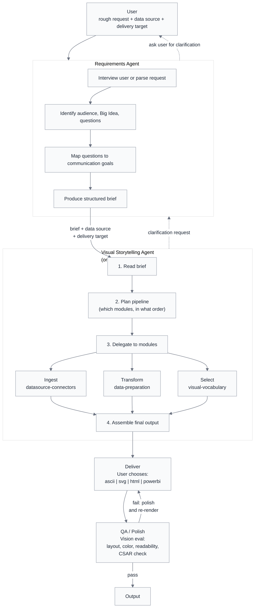

# Alex ACT Visual Storytelling -- Project Plan

## Mission

Build a modular plugin collection that turns data into visual stories. The plugins publish to the [Alex ACT Plugin Mall](https://github.com/fabioc-aloha/Alex_ACT_Plugin_Mall) and work with any ACT heir.

This is the "Power BI alternative for AI agents": instead of opening a BI tool, a heir loads the right plugins and produces SVG dashboards, HTML reports, or Markdown narratives from data, guided by a requirements document.

## Architecture

### Agent-Orchestrated Pipeline

The Visual Storytelling system is a two-layer sub-agent hierarchy that any ACT
heir can invoke. The user provides a rough request, a data source, and a delivery
target. The system generates a structured brief, then executes the full pipeline.

```text
User: "Show me how sales are trending. Data is in sales.csv. ASCII dashboard."

                          User
                           │
          rough request + data source + delivery target
                           │
                           v
  ┌─────────────────────────────────────────────────────────┐
  │              Requirements Agent                         │
  │            (storytelling-requirements)                  │
  │                                                         │
  │  - Interview user or parse request                      │
  │  - Identify audience, Big Idea, questions               │
  │  - Map questions to communication goals                 │
  │  - Produce structured brief                             │
  └──────────┬──────────────────────────────────────────────┘
             │                          │
    ask user │                          │ brief + data source
    for      │                          │ + delivery target
    clarity  │                          │
             v                          │
           User          ▲ clarification│
                         │ request      │
                         │              v
  ┌─────────────────────────────────────────────────────────┐
  │              Visual Storytelling Agent                  │
  │                   (orchestrator)                        │
  │                                                         │
  │  1. Read brief                                          │
  │  2. Plan pipeline (which modules, in what order)        │
  │  3. Delegate to modules                                 │
  │  4. Assemble final output                               │
  │                                                         │
  │  Can push back to Requirements Agent if:                │
  │  - Brief is ambiguous or incomplete                     │
  │  - Data doesn't match what the brief assumes            │
  │  - Delivery target can't support a requested visual     │
  └────────────────────────┬────────────────────────────────┘
                           │
           ┌───────────────┼───────────────────┐
           │               │                   │
           v               v                   v
    ┌─────────────┐ ┌─────────────┐  ┌────────────────┐
    │   Ingest    │ │  Transform  │  │    Select      │
    │             │ │             │  │                │
    │  datasource │ │  data-      │  │  visual-       │
    │  connectors │ │  preparation│  │  vocabulary    │
    └──────┬──────┘ └──────┬──────┘  └───────┬────────┘
           │               │                 │
           └───────────────┼─────────────────┘
                           │
                           v
                 ┌───────────────────┐
                 │     Deliver       │
                 │                   │
                 │  User chooses:    │
                 │  ascii | svg      │
                 │  html  | powerbi  │
                 └─────────┬─────────┘
                           │
                           v
                 ┌───────────────────┐
                 │     QA / Polish   │
                 │                   │
                 │  Vision eval:     │
                 │  layout, color,   │
                 │  readability,     │
                 │  CSAR check       │
                 └────┬────────┬─────┘
                      │        │
           fail: fix  │        │ pass
           and re-    │        │
           render     │        v
                      │    Output
                      │
                      └───► Deliver
                          (loop back)
```

Two layers, one invocation:

- **Requirements Agent** follows the **Creative Cycle** (Ideate, Plan, Build,
  Test, Release, Improve) to generate the brief. It interviews the user or
  parses a rough request, iterates on audience/Big Idea/questions until the
  brief is solid, then hands it down. If the user already has a structured
  brief, this layer validates and passes it through.
- **Orchestrator** reads the brief, plans the pipeline, delegates to modules.
  If the brief is ambiguous, the data doesn't match assumptions, or the
  delivery target can't support a requested visual, the orchestrator **pushes
  back** to the Requirements Agent for clarification before proceeding.
  After delivery, the **CSAR loop** (Completeness, Simplicity, Accuracy,
  Readability) drives the QA step: render, evaluate with vision, polish
  colors/layout/spacing, re-evaluate until the output passes. The user gets
  a finished product, not a first draft.

Swappable parts:

- "Data is in a SQL database" --> only the Ingest module changes
- "Deliver as SVG instead"   --> only the Deliver module changes
- The orchestrator re-plans; the user does not re-wire the pipeline

### Architecture Diagram (Mermaid)



### Module Pipeline (reference)

The modules the orchestrator calls, shown as a linear data flow:

```text
User has data + a question
         |
         v
  storytelling-requirements   <-- guided intake (the "brief")
         |
         v
  datasource-connectors       <-- ingest: CSV, JSON, API, SQL, etc.
         |
         v
  data-preparation             <-- clean, profile, aggregate, pivot
         |
         v
  visual-vocabulary            <-- select chart types by communication goal
         |
         v
  delivery-*                   <-- render to target format
    |- delivery-ascii-dashboard    Pure ASCII art (cheapest, LLM-native)
    |- delivery-svg-markdown       SVG panels in Markdown (GitHub-native)
    |- delivery-html-dashboard     Self-contained HTML with Chart.js
    |- delivery-powerbi-fabric     Power BI / Microsoft Fabric
    |- (backlog: other platforms)
```

Each box is one Mall plugin. A heir installs only what they need: a project doing SVG dashboards skips the Power BI delivery plugin; a Fabric project skips SVG.

## Design Principles

1. **DRY/KISS modular collection.** Each plugin does one thing. No plugin duplicates another.
2. **Selection is universal; delivery is swappable.** `visual-vocabulary` and `storytelling-requirements` are platform-agnostic. Delivery plugins are platform-specific.
3. **Requirements document is the input.** Every storytelling project starts with a structured brief (audience, Big Idea, questions, data sources). The `storytelling-requirements` plugin provides the template and guides the user through it.
4. **Publish to the Mall, develop here.** This repo is the factory; the Mall is the storefront. Finished plugins get copied to `Alex_ACT_Plugin_Mall/plugins/data-analytics/`.
5. **Living references over static knowledge.** Chart galleries, API docs, and tool documentation change. Link to the living source; encode decision frameworks and judgment in the plugin.

## Plugin Inventory

### Phase 1 -- Core Pipeline (v0.1.0)

| Plugin | Status | Category | Description |
| --- | --- | --- | --- |
| `visual-vocabulary` | Published | data-analytics | Chart catalog by communication goal, CSAR evaluation loop, 5-visual rule, SVG patterns, living gallery links |
| `storytelling-requirements` | Published | data-analytics | Guided requirements document template: audience, Big Idea, questions, data sources, delivery target, constraints |
| `data-preparation` | Complete | data-analytics | Data cleaning checklist, profiling patterns, aggregation recipes, pivot/unpivot guidance, quality gates |
| `datasource-connectors` | Complete | data-analytics | Ingestion patterns for CSV, JSON, REST API, SQL, Excel, Parquet. Connection string templates, pagination, auth |
| `delivery-ascii-dashboard` | Published | data-analytics | Pure ASCII art dashboards in monospace text: KPI strips, bar charts, sparklines. Zero dependencies, LLM-native, predictable character geometry |

### Phase 2 -- Delivery Targets (v0.2.0)

| Plugin | Status | Category | Description |
| --- | --- | --- | --- |
| `delivery-svg-markdown` | Planned | media-graphics | SVG dashboard composition for Markdown/GitHub: panel primitives, coordinate systems, dark-slate palette, viewBox math |
| `delivery-html-dashboard` | Planned | data-analytics | Self-contained HTML with Chart.js: KPI cards, responsive grid, embedded data, print-friendly, zero build step |

### Phase 3 -- Enterprise Delivery (v0.3.0)

| Plugin | Status | Category | Description |
| --- | --- | --- | --- |
| `delivery-powerbi-fabric` | Planned | data-analytics | Power BI report design patterns, Fabric integration, semantic model guidance, Copilot-ready data prep |

### Backlog -- Future Platforms

| Plugin | Description |
| --- | --- |
| `delivery-vega-lite` | Declarative Vega-Lite spec generation for web embedding |
| `delivery-observable` | Observable Framework notebook output |
| `delivery-slides` | Marp/PPTX presentation output with data charts |
| `delivery-pdf-report` | PDF report generation via pandoc/weasyprint |
| `delivery-email-digest` | Email-friendly HTML digest with inline charts |

## Relationship to Existing Mall Plugins

This repo develops plugins that complement (not replace) existing Mall entries:

| Existing Mall Plugin | Relationship | This Repo's Plugin |
| --- | --- | --- |
| `data-storytelling` | Narrative arc (three-act, Knaflic/Duarte) | `storytelling-requirements` provides the structured intake that feeds it |
| `data-visualization` | Chart design (color, annotation, decluttering) | `visual-vocabulary` selects the chart; `data-visualization` designs it |
| `dashboard-design` | Layout patterns (inverted pyramid, KPI cards) | `delivery-*` plugins render the layout to a specific format |
| `svg-dashboard-composition` | SVG composition mechanics | `delivery-svg-markdown` absorbs and extends this |
| `data-analysis` | Exploratory analysis patterns | `data-preparation` focuses on the cleaning/profiling step before analysis |
| `chart-interpretation` | Reading existing charts | The inverse: `visual-vocabulary` creates; `chart-interpretation` reads |

## Source Knowledge

| Source | What It Contributes |
| --- | --- |
| VT_AIPOWERBI (VT course) | CSAR evaluation loop, 5-visual rule, Copilot Design Automation framework, Kirk/Knaflic pedagogy, case studies |
| Supervisor fleet dashboard | SVG composition patterns, panel primitives, coordinate anti-patterns, dark-slate palette |
| Alex_ACT_Plugin_Mall | Existing plugin structure (plugin.json, SKILL.md, README.md), installation paths, CATALOG.json schema |
| FT Visual Vocabulary | Chart catalog organized by communication goal (living reference) |
| From Data to Viz | Chart selection by data type (living reference) |

## Development Workflow

1. **Design** the plugin in `plugins/<name>/` with SKILL.md + plugin.json + README.md
2. **Test** against datasets in `datasets/` and scenarios in `tests/`
3. **Review** using the Supervisor's skill-review 4-gate process
4. **Publish** by copying to `Alex_ACT_Plugin_Mall/plugins/<category>/<name>/`
5. **Update** CATALOG.json and README counts in the Mall

## Success Criteria

| Criterion | Status |
| --- | --- |
| All Phase 1 plugins published to Mall | 3 of 5 published; `data-preparation` complete, `datasource-connectors` planned |
| A heir can go from raw CSV to dashboard in one session | Orchestrator agent exists; test scenario written; not yet end-to-end tested |
| The storytelling-requirements template matches VT class process | Published and validated |
| Each plugin is under 500 lines | All plugins pass (largest: visual-vocabulary at ~330 lines) |
| Token cost of full collection stays under 15K | 9,400 tokens for 4 plugins. Budget: 15K. Headroom: 5,600 |

## Repo Structure

```text
Alex_ACT_Visual_Storytelling/
  PLAN.md              -- this file
  README.md            -- public-facing overview
  plugins/             -- plugin development workspace
    visual-vocabulary/     SKILL.md, plugin.json, README.md (published)
    storytelling-requirements/  SKILL.md, plugin.json, README.md (published)
    data-preparation/      SKILL.md, plugin.json, README.md (complete)
    datasource-connectors/ (planned -- README only)
    delivery-ascii-dashboard/  SKILL.md, plugin.json, README.md (published)
    delivery-svg-markdown/ (planned -- README only)
    delivery-html-dashboard/ (planned -- README only)
    delivery-powerbi-fabric/ (planned -- README only)
  backlog/             -- future platform delivery plugins
  datasets/            -- test data for development
    sales-sample.csv       24 rows, 6 months, 2 regions, 2 products
  templates/           -- the storytelling requirements template
  tests/               -- plugin test scenarios
    sales-dashboard-ascii.md  filled brief + expected outcome
  references/          -- source material and notes
  .github/agents/
    visual-storytelling.agent.md  orchestrator agent definition
```
